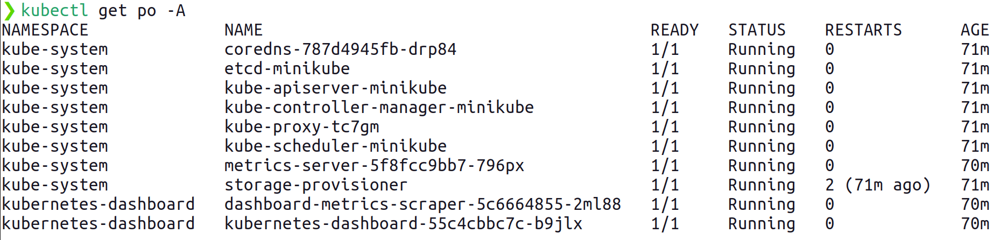

# Kubernetes Lab
## Prerequisites

## Python
 - python3
 - python3-pip
 - python virtual environment (venv)

## Kubernetes local single-node cluster
 - [docker](https://docs.docker.com/)
 - [minikube](https://minikube.sigs.k8s.io/docs/start/)
 - [kubectl](https://kubernetes.io/docs/tasks/tools/#kubectl)

### Environment setup
- Setup of a new kubernetes cluster:
    ```bash
    minikube start
    ```
- Test kubectl:
    ```bash
    kubectl cluster-info
    ```
    
    this command should return something similar to this output:
    ```
    Kubernetes control plane is running at https://192.168.49.2:8443
    CoreDNS is running at https://192.168.49.2:8443/api/v1/namespaces/kube-system/services/kube-dns:dns/proxy

    To further debug and diagnose cluster problems, use 'kubectl cluster-info dump'.     
    ```
- Enable the required addons:
    ```bash
    minikube addons enable metrics-server
    minikube addons enable dashboard 
    ```
- Wait until all Pods are up and running:
    ```bash
     kubectl get po -A
    ```

    

### Kubernetes Dashboard
Open a new terminal and type
```bash
minikube dashboard
```
A new browser window will be open with the dashboard. Keep the terminal open to mantain the service online.

## Part 1 - Flask app in a local environment
For this parts is assumed that you are in the main directory of the project. 
- Create a python virtual environment
    ```bash
    python3 -m venv flask-env
    ```
- Activate the virtual environment
    ```bash
    source flask-env/bin/activate
    ```
- Install the python dependencies
    ```bash
    pip install -r requirements.txt
    ```
- Try the base functionality of the base app
    ```bash
    python app-simple.py
    ```
- Visit the proposed page to ensure that the application is working properly.

## Part 2 - Containerization
- Create a Docker Image for the service
    ```bash
    docker build -t myflask:1 .
    ```
- Create a Docker Container that hosts the service
    ```bash
    docker run -p 5000:5000 myflask:1
    ```
- Visit the proposed page to ensure that the application is working properly.

At this point you can push the built docker image to [Docker Hub](https://hub.docker.com/), to allow later retrieval on Kubernetes. For this tutorial, an image that has already been uploaded to Docker Hub will be used, so the subsequent steps are optional. A Docker Hub account is required for these steps.

- Login from the terminal to Docker hub
    ```bash
    docker login
    ```
    following the prompted instructions

- tag the Docker Image with your Docker Hub username
    ```
    docker tag myflask:1 <your-username-here>/myflask:1 
    ```
- Push the Docker Image to Docker Hub
    ```
    docker push <your-username-here>/myflask:1 
    ```

## Part 3 - Orchestration
### Deploy the application on Kubernetes
- Create a Deployment
    ```bash
    kubectl apply -f myflask-deployment.yaml
    ```
- Create a Service
    ```bash
    kubectl apply -f myflask-service.yaml
    ```
- Expose the Service to the host network
    ```bash
    minikube service myflask-service
    ```

### Update the Deployment
- Modify a Deployment (e.g.: change the tag of the image from 1 to 2)
    ```bash
    kubectl edit deployment myflask-deployment
    ```
- Check whether the system has successfully rolled out the deployment
    ```bash
    kubectl rollout status deployment myflask-deployment
    ```
In addition to this step, you can start the script that floods the service with requests, update the deployment, and see how the responses change. An example of invocation of the script, sending 10000 requests, is the following:
```bash
python flood.py --requests 500 --workers 1 --delay 0.5 http://<address-provided-by-minikube>:30000
```

### Scale out the Deployment
- Scale from two to three replicas
    ```bash
    kubectl scale --current-replicas=2 --replicas=3 deployment myflask-deployment
    ```
Check the Dashboard to see the changes.

### Adding an Autoscaler
- Add an Horizontal Pod Autoscaler (HPA)
    ```bash
    kubectl autoscale deployment myflask-deployment --cpu-percent=50 --min=3 --max=10
    ```
- Check the HPA status 
    ```bash
    kubectl get hpa -w
    ```
- Flood with requests the deployment, to see if it scales
    ```bash
    python flood.py --requests 10000 http://<address-provided-by-minikube>:30000
    ```
Check the Dashboard or HPA status and wait a few moments to see the changes.
